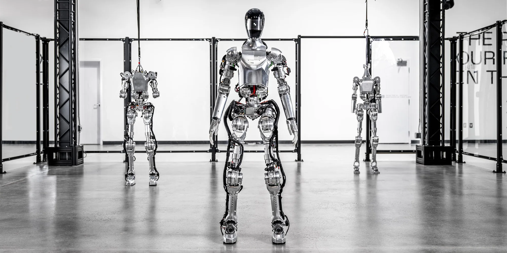

# Case study of an AI Company

## Overview and Origin

* Figure AI, a pioneering startup focused on creating humanoid robots for high-risk and undesirable tasks, recently received significant endorsement from leading figures in the artificial intelligence community.

* On Feburary 29th, the startup announced it had secured $675 million in funding, achieving a valuation of $2.6 billion, with notable investors including Jeff Bezos, Nvidia, Microsoft, and OpenAI.

* The goal of Figure AI is to "deploy autonomous humanoid workers to supports us on a global scale"(Figure, 2024). Founded in 2022, Figure AI has brought to life the Figure 01, a versatile robot with a human-like appearance and mobility. The company envisions employing these robots in sectors like manufacturing, shipping and logistics, warehousing, and retail, particularly in areas suffering from acute labor shortages. However, the use of these robots in military or defense roles is not part of the company's plans.

* Figure AI's grand vision for the Figure 01 is to enable it to carry out daily activities independently, a goal that will necessitate the development of more advanced AI technologies.

## Business Activities

### Difficulty

* The current landscape is marked by unprecedented labor shortages, with over 10 million jobs in the United States deemed unsafe or undesirable. This challenge is compounded by an aging population, leading to a stagnation in labor supply growth projected for this century. To counteract this and foster continued growth, there is a pressing need for enhanced productivity through increased automation.

### Possibility

* The nascent stages of an AI and Robotics revolution present a unique opportunity to significantly boost production and improve living standards. As automation becomes more integrated into everyday life, it is anticipated that the traditional labor-based economy will undergo a transformation. Robots, with capabilities to think, learn, reason, and interact with their surroundings, are expected to outperform human task execution. Currently, manual labor costs drive the prices of goods and services, accounting for approximately 50% of the global GDP (~$42 trillion/year). However, as robots become integrated into the workforce across diverse sectors from manufacturing to agriculture, labor costs are predicted to align with the cost of renting a robot. This shift is projected to lower costs over time, potentially removing humans from the production loop as robots gain the capability to construct other robots, further driving down prices and enhancing productivity. The advent of manual labor becoming optional and the potential for an abundance of affordable goods and services could lead to increased wealth and a higher standard of living for all.

* The potential of humanoid robots to revolutionize various industries is significant, from corporate labor roles encompassing over three billion humans to assisting over two billion individuals at home, caring for approximately one billion elderly, and even aiding in the construction of new worlds on other planets. Initially, humanoid robots will be deployed in sectors facing acute labor shortages such as manufacturing, shipping and logistics, warehousing, and retail. These robots will initially perform structured and repetitive tasks, but as technology advances, their capabilities are expected to expand to more complex job functions. 

### Solution

* Figure AI is committed to developing general-purpose humanoid robots tailored to operate within human environments, avoiding military, defense, or harmful applications. The design of these robots mirrors the human form—two legs, two arms, hands, and a screen for a face—to seamlessly integrate into and navigate the complexities of human environments.

### How to Do It

* Significant technological advancements are necessary to realize the full potential of general-purpose humanoid robots. Even routine tasks, such as unloading a dishwasher, present substantial challenges for current robotics. Figure AI's focus is on advancing in several critical areas:

1. System Hardware: The development of a fully electromechanical humanoid, including hands, aims to achieve the physical capabilities of a non-expert human across various metrics such as range of motion, payload, and speed. Continuous improvement will be sought through rapid development cycles.

2. Unit Cost: Achieving affordable unit costs through high-volume manufacturing is a goal, with the aim to establish a sustainable economy of scale.

3. Safety: Ensuring safe interaction between humanoids and humans in the workplace is paramount, with designs adhering to industry standards and corporate requirements.

4. Volume Manufacturing: High-quality product delivery at exceptional volumes is anticipated, necessitating thoughtful planning in design for manufacturing, system safety, reliability, and quality.

5. Artificial Intelligence: Developing an AI system capable of enabling humanoid robots to autonomously perform everyday tasks is a formidable challenge, addressed by creating intelligent embodied agents capable of navigating complex, unstructured environments.

### Technology

* In [video published by Figure](https://www.youtube.com/watch?v=Sq1QZB5baNw), Figure 01 stands at a height of 5 feet 6 inches and weighs 132 pounds, incorporating OpenAI’s advanced large language models to facilitate engaging conversations with humans. Equipped with multi-modal input capabilities, it merges high-level visual and linguistic intelligence, pushing the boundaries of human-robot interaction to new heights. In a notable demonstration, Figure 01 displayed its ability to instantly recognize objects and answer questions in real time.

* The seamless interaction with humans by Figure 01 is underpinned by a new Visual Language Model (VLM). This VLM, resulting from a collaboration between OpenAI and Figure, the startup behind Figure 01, transforms Figure 01 from being merely a clunky assembly into a futuristic robot with an eerily human-like appearance. Brett Adcock, the founder of Figure, has stated that Figure 01 is equipped with onboard cameras. These cameras feed data to the VLM, aiding the robot in "understanding" the scene in front of it and enabling smooth interactions with humans. Along with Adcock, the creation of Figure 01 has been influenced by key individuals from Boston Dynamics, Tesla, Google Deep Mind, and Archer Aviation.

## Landscape

* Figure AI is a company specializing in AI Robotics, dedicated to creating the world's initial commercially viable autonomous humanoid robot.

* Although numerous humanoid robots remain in the prototype stage or other initial phases of development, several have made their way out of research and development recently, transitioning into practical roles such as bartenders, concierge services, deep-sea exploration, and companionship for the elderly. A number are employed in warehouses and factories, where they support human workers in logistics and manufacturing tasks. Meanwhile, some humanoid robots serve primarily to fascinate and captivate, taking on roles such as orchestra conductors and welcoming hosts at conferences.

### Examples of Humanoid Robots

#### **1. AMECA (ENGINEERED ARTS)**

* Engineered Arts has introduced Ameca as its most sophisticated humanoid robot yet, marketed as a platform for experimenting with AI and machine learning technologies. Ameca comes equipped with sensors capable of monitoring movement throughout an entire room and features both facial and voice recognition abilities, enabling it to engage with humans in a natural manner while also identifying their emotions and age. The robot can express common human reactions, such as astonishment and surprise, and perform gestures such as yawning and shrugging.

#### **2. DIGIT (AGILITY ROBOTICS)**

* Digit, a humanoid robot developed by Agility Robotics, is already skilled in tasks such as unloading trailers and handling packages, and it's set to tackle an even broader array of monotonous duties. Equipped with fully operational limbs, Digit can perform actions like crouching and squatting to pick up items, adjusting its balance based on the object's size and weight. Additionally, its surface plane-reading sensors enable it to navigate efficiently, avoiding obstacles along its path. In 2019, Agility Robotics formed a partnership with Ford to explore autonomous package delivery. By 2022, Agility had secured $150 million in funding from Amazon among other investors, aimed at integrating Digit more fully into the labor market.

#### **3. JIAJIA (UNIVERSITY OF SCIENCE AND TECHNOLOGY OF CHINA)**

* Developed by a team from the University of Science and Technology of China, Jiajia represents China's inaugural venture into humanoid robots. The development of Jiajia was a three-year endeavor. During its unveiling in 2016, team leader Chen Xiaoping informed the press that plans were underway to enhance Jiajia with the ability to express emotions such as crying and laughing, as reported by the Independent. Mashable notes that Jiajia's design, closely resembling human features, was inspired by five students from the same university.

#### **4. ALTER 3 (OSAKA UNIVERSITY AND MIXI)**

* Named Alter 3, this advanced humanoid robot created by Osaka University and mixi operates on an artificial neural network, showcasing a remarkable musical aptitude. Previous versions of Alter have performed in opera settings. With its upgraded sensors and enhanced abilities for expression and singing, Alter 3 took its talents a step further in 2020 by leading an orchestra at Tokyo's New National Theater and participating in various live performances.

## Results

* The introduction of Figure 01 has generated significant praise and drawn comparisons to other AI-powered robotics projects. Unlike earlier displays that depended on remote control or prearranged setups, Figure 01 distinguishes itself through its authentic autonomy and intellectual abilities. Its capacity for detailed conversations and real-time task performance establishes a fresh standard in the realm of humanoid robotics.

* With Figure 01 stepping into the forefront, it represents not just the result of extensive research and development but also marks the beginning of an era where robots resembling humans integrate effortlessly with our society. Although there are hurdles to overcome regarding its widespread acceptance and ethical implications, the pioneering advancements of Figure highlight the revolutionary impact of AI-driven robotics. As the world enter a new phase of partnership between humans and robots, Figure 01 stands as a symbol of the limitless potential of technological advancements.

## Advised Product: Customizable Companion Robots for Elderly Care

### Rationale for the Suggestion:

* In the realm of robotics, there is a growing need for solutions that cater to the aging population. Customizable companion robots for elderly care could address a significant market demand, focusing on providing companionship, assistance with daily tasks, and health monitoring for the elderly. This service would not only diversify Figure AI's product line but also position the company at the forefront of a socially beneficial sector, demonstrating a commitment to leveraging technology for enhancing quality of life.

### Benefits to Figure AI:

* Offering customizable companion robots for elderly care could open up a new revenue stream for Figure AI and establish the company as a leader in socially responsible innovation. This initiative could also enhance brand reputation, attract partnerships with healthcare organizations, and potentially unlock government or private funding for health and welfare technology projects.

### Technologies Utilized:

1. **Artificial Intelligence and Machine Learning:** For personalizing interactions, learning the preferences and routines of the elderly, and adapting responses accordingly.

2. **Natural Language Processing (NLP):** To enable the robots to understand and process natural human language, allowing for meaningful conversations and companionship.

3. **Sensors and IoT Devices:** For health monitoring, including detecting falls, monitoring vital signs, and integrating with medical devices to alert caregivers or medical professionals in emergencies.

4. **Mobility and Manipulation Technology:** To assist with physical tasks around the home, enhancing the independence of elderly individuals.

## Reference
* OpenAI. (2023). ChatGPT (Mar 14 version) [Large language model]. https://chat.openai.com/chat
* Urwin, M. (2024, March 1). *Top 22 Humanoid Robots in Use Right Now.* Builtin. https://builtin.com/robotics/humanoid-robots
* Basheer, K. C. S. (2024, March 15). *Figure AI's Humanoid Robot Starts to Talk Like Humans.* Analytics Vidhya. https://www.analyticsvidhya.com/blog/2024/03/figure-ai-humanoid-robot-figstarts-to-talk-like-humans/
* Palmer, A. (2024, February). *Humanoid robot startup Figure AI valued at $2.6 billion as Bezos, OpenAI, Nvidia join funding.* CNBC. https://www.cnbc.com/2024/02/29/robot-startup-figure-valued-at-2point6-billion-by-bezos-amazon-nvidia.html
* Figure. (n.d.). https://www.figure.ai/
* Figure. (2024, March 13). *Figure Status Update - OpenAI Speech-to-Speech Reasoning.* YouTube. https://www.youtube.com/watch?v=Sq1QZB5baNw
* Gedeon, K. (2024, March 14). *It's like ChatGPT with a body: Watch creepy demo of OpenAI-powered robot 'Figure 01'.* Mashable. https://mashable.com/article/figure-01-open-ai
* Ahmad, H. (2024, March 14). *OpenAI’s Figure 01: Wonder of AGI.* Medium. https://medium.com/@haroonahmad13055/openais-figure-01-wonder-of-agi-in-robotics-404a1ede6663